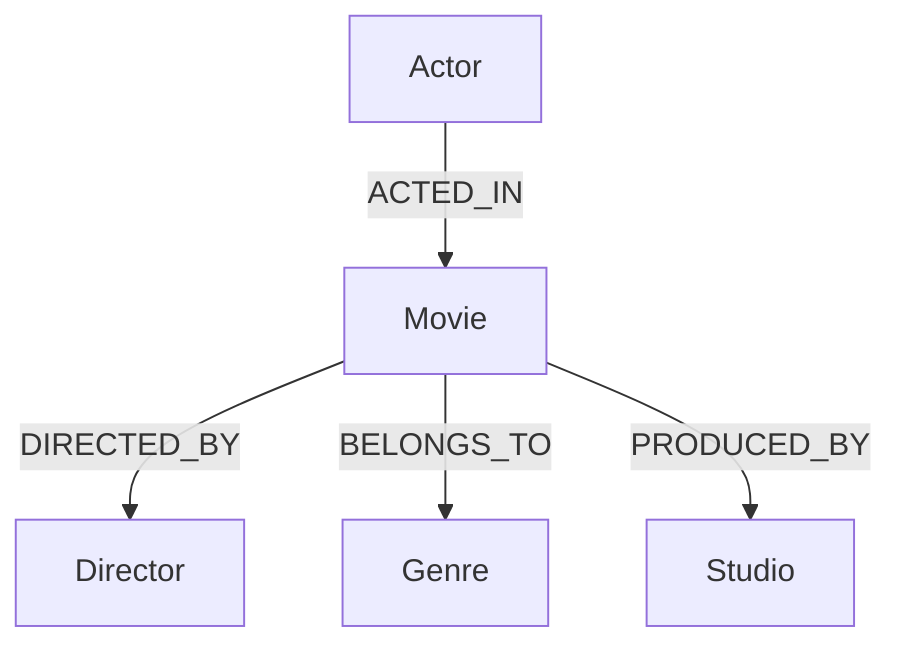

Live Demo : https://cinegraph-1-xj6o.onrender.com/

# CineGraph

A movie and series relationship explorer, built to demonstrate that a graph database is the natural fit when the core product experience *is* traversing relationships — not just storing records.

## Overview

CineGraph lets you explore how movies, actors, directors, genres, and studios connect. Pick a movie and see which other films share its cast. Pick an actor and see every director they've worked with. Trace a path from one movie to another through the people who made them. None of this is precomputed — every connection you see is the live result of a Cypher traversal against CognDB Cloud.

## Features

- Browse and search a library of 30 movies and 40 actors
- Movie detail pages showing cast, genres, studio, director, and **live connected-movie recommendations** based on shared cast
- Actor detail pages showing filmography, genres worked in, and directors collaborated with
- A dedicated **Explore Connections** tool that visualizes a 3-hop relationship chain (movie → actor → other movie → director) for any selected film
- Loading, empty, and error states on every data view
- Fully responsive, accessible layout

## Technology Stack

**Frontend:** React, Vite, JavaScript, plain CSS (custom design system, no framework)
**Backend:** Node.js, Express.js, JavaScript
**Database:** CognDB Cloud (Bolt protocol, Neo4j-compatible), official `neo4j-driver` package, Cypher
**Deployment target:** Frontend → Vercel, Backend → Render, Database → CognDB Cloud

## Why a Graph Database?

CineGraph's core feature isn't listing movies — it's answering questions like *"what else connects to this?"* Consider the primary traversal the app is built around:

```
Actor → ACTED_IN → Movie → DIRECTED_BY → Director
```

or the one that powers the "Connected Movies" feature:

```
Movie ← ACTED_IN ← Actor → ACTED_IN → Other Movie
```

In a graph database, both of these are a single `MATCH` pattern — the query text mirrors the relationship you're actually asking about. In a relational schema, the same question requires a join table for the many-to-many actor↔movie relationship, a self-join back into that table to find "other movies with the same actor," a `GROUP BY` to count shared actors, and a further join out to directors if you want to go one hop further (as the Explore Connections page does). Each additional hop in the question is another join in SQL, but just another `-->` in Cypher.

This isn't a claim that graph databases are faster than relational ones in general — for fixed, shallow queries a well-indexed relational schema can perform perfectly well. The advantage here is specifically about **expressiveness for variable-depth, relationship-centric questions**: the query structure stays flat and readable as CineGraph asks 1-hop, 2-hop, and 3-hop questions of the same data, where the equivalent SQL would grow a new join and a new intermediate table alias with every additional hop.

## Graph Data Model



**Nodes:**
| Node | Properties |
|---|---|
| `Movie` | `id`, `title`, `releaseYear`, `rating`, `description` |
| `Actor` | `id`, `name`, `birthYear` |
| `Director` | `id`, `name` |
| `Genre` | `id`, `name` |
| `Studio` | `id`, `name` |

**Relationships:** `(:Actor)-[:ACTED_IN]->(:Movie)`, `(:Movie)-[:DIRECTED_BY]->(:Director)`, `(:Movie)-[:BELONGS_TO]->(:Genre)`, `(:Movie)-[:PRODUCED_BY]->(:Studio)`

No `SIMILAR_TO` edge was added. "Connected movies" is computed live via the shared-actor traversal rather than precomputed — this is more representative of what a graph database is actually useful for, and it stays correct automatically as the dataset grows.

## Project Structure

```
cinegraph/
├── server/
│   ├── src/
│   │   ├── db/driver.js        # Neo4j driver singleton + query runner
│   │   ├── routes/              # Express route definitions
│   │   ├── controllers/         # Request/response handling, status codes
│   │   ├── services/            # All Cypher queries live here
│   │   └── app.js               # Express app + centralized error handling
│   ├── scripts/
│   │   ├── seed.js              # Seed runner (idempotent, MERGE-based)
│   │   └── seedData.js          # Raw seed dataset
│   ├── .env.example
│   └── package.json
├── client/
│   ├── src/
│   │   ├── pages/                # One file per route
│   │   ├── components/           # Nav, cards, shared states, Sprocket motif
│   │   ├── api/                  # fetch client + per-resource modules + useFetch hook
│   │   └── App.jsx
│   ├── .env.example
│   └── package.json
└── README.md
```

## CognDB Setup

1. Create a CognDB Cloud account.
2. Create a free instance from the CognDB Cloud dashboard.
3. Once provisioned, copy the **Bolt URI** (a `neo4j+s://...` connection string).
4. Copy the generated **password** for the default `cognodb` user (or whichever username your instance provides).
5. Put both values into `server/.env` (see below).
6. The backend connects using the official `neo4j-driver` npm package over the Bolt protocol — no CognDB-specific SDK is required.

> **Note:** the exact URI scheme and port shown above match the standard Neo4j Bolt convention described in the assignment. If your CognDB dashboard presents a different connection string format, use the value shown in your dashboard rather than the placeholder here.

## Installation

```bash
# Backend
cd server
npm install

# Frontend
cd ../client
npm install
```

## Environment Variables

**server/.env** (copy from `server/.env.example`):
```
COGNODB_URI=neo4j+s://your-instance-id.cogndb.cloud
COGNODB_USERNAME=cognodb
COGNODB_PASSWORD=your-password-here
PORT=5000
```

**client/.env** (copy from `client/.env.example`):
```
VITE_API_BASE_URL=http://localhost:5000/api
```

Never commit either `.env` file — both are covered by `.gitignore`.

## Database Seeding

```bash
cd server
npm run seed
```

This populates CognDB with 30 movies, 40 actors, 15 directors, 10 genres, and 7 studios, plus every relationship between them. The script uses `MERGE` keyed on each node's `id`, so re-running it updates existing data instead of creating duplicates, and it logs a count for each entity/relationship type as it goes.

## Running Locally

```bash
# Terminal 1 — backend
cd server
npm run dev      # http://localhost:5000

# Terminal 2 — frontend
cd client
npm run dev       # http://localhost:5173
```

## API Endpoints

| Method | Path | Description |
|---|---|---|
| GET | `/api/health` | DB connectivity check |
| GET | `/api/stats` | Dashboard counts |
| GET | `/api/movies` | List movies |
| GET | `/api/movies/:id` | Movie detail |
| GET | `/api/movies/:id/actors` | Cast of a movie (Query 2) |
| GET | `/api/movies/:id/connections` | Connected movies via shared cast (Query 4) |
| GET | `/api/movies/:id/explore` | 3-hop graph exploration (Query 5) |
| GET | `/api/movies/:id/discover` | Shared actor + shared genre matches (Query 6) |
| GET | `/api/actors` | List actors |
| GET | `/api/actors/:id` | Actor detail |
| GET | `/api/actors/:id/movies` | Filmography (Query 1) |
| GET | `/api/actors/:id/directors` | Directors worked with (Query 3) |
| GET | `/api/directors` | List directors |
| GET | `/api/genres` | List genres |
| GET | `/api/studios` | List studios |

## Important Cypher Queries

**Query 1 — Movies by actor** (1 hop)
```cypher
MATCH (a:Actor {id: $id})-[:ACTED_IN]->(m:Movie)
RETURN m.id, m.title, m.releaseYear, m.rating
```
Direct traversal from actor to their filmography.

**Query 3 — Directors for an actor** (2 hops)
```cypher
MATCH (a:Actor {id: $id})-[:ACTED_IN]->(m:Movie)-[:DIRECTED_BY]->(d:Director)
WITH d, collect(DISTINCT m.title) AS movies, count(DISTINCT m) AS movieCount
RETURN d.id, d.name, movies, movieCount
```
Walks from actor through movie to director, aggregating in the same pass.

**Query 4 — Connected movies** (2 hops)
```cypher
MATCH (m:Movie {id: $id})<-[:ACTED_IN]-(a:Actor)-[:ACTED_IN]->(other:Movie)
WHERE other.id <> $id
WITH other, collect(DISTINCT a.name) AS sharedActors, count(DISTINCT a) AS sharedActorCount
RETURN other.id, other.title, sharedActors, sharedActorCount
ORDER BY sharedActorCount DESC
```
The query behind "Connected Movies" — finds every other movie reachable through a shared actor, self-excludes, and ranks by overlap.

**Query 5 — Graph exploration** (3 hops, the highlighted graph-native query)
```cypher
MATCH (m:Movie {id: $id})<-[:ACTED_IN]-(a:Actor)-[:ACTED_IN]->(other:Movie)
WHERE other.id <> $id
MATCH (other)-[:DIRECTED_BY]->(d:Director)
WITH other, d, collect(DISTINCT a.name) AS viaActors
RETURN other.id, other.title, d.id, d.name, viaActors
```
Extends Query 4 one hop further to the director of each connected movie. Powers the Explore Connections page.

**Query 6 — Discovery by genre and actor** (2 hops, two conditions)
```cypher
MATCH (m:Movie {id: $id})-[:BELONGS_TO]->(g:Genre)<-[:BELONGS_TO]-(other:Movie)
WHERE other.id <> $id
MATCH (m)<-[:ACTED_IN]-(a:Actor)-[:ACTED_IN]->(other)
WITH other, collect(DISTINCT g.name) AS sharedGenres, collect(DISTINCT a.name) AS sharedActors
RETURN other.id, other.title, sharedGenres, sharedActors
```
Requires both a shared genre *and* a shared actor — demonstrates combining two independent relationship conditions in one traversal.

All six queries take user-provided values only through named parameters (`$id`) — never string concatenation.

## Why These Queries Are Graph-Native

Query 4, 5, and 6 all share a shape: start at one node, cross a relationship out and a relationship back in to find peers, then optionally continue outward. In Cypher this is a single pattern match. In SQL, Query 5 alone would need: a join from actors to movies (via a junction table), a self-join back into that junction table to find co-starring movies, a join to a directors junction table, and a `GROUP BY`/`HAVING` to dedupe and aggregate — four joins and an aggregation for what's a `MATCH` with two arrows here. The relationship, not the record, is the unit the query is written in terms of, which is exactly what CineGraph's UI is built to surface.

## Screenshots

_Add screenshots here after running the app locally or viewing the hosted demo:_
- Dashboard
- Movie Explorer
- Movie Details (with Connected Movies section visible)
- Actor Details
- Explore Connections

## Deployment

**Backend (Render):**
1. Create a new Web Service pointing at the `server/` directory.
2. Build command: `npm install`. Start command: `npm start`.
3. Set environment variables in the Render dashboard: `COGNODB_URI`, `COGNODB_USERNAME`, `COGNODB_PASSWORD`, `PORT` (Render sets `PORT` automatically — leave your code reading `process.env.PORT`, which it already does).

**Frontend (Vercel):**
1. Import the `client/` directory as a new Vercel project.
2. Framework preset: Vite.
3. Set `VITE_API_BASE_URL` in Vercel's environment variables to your deployed Render backend URL, e.g. `https://your-backend.onrender.com/api`.

**Database:** CognDB Cloud is already hosted — no deployment step, just make sure the production backend's environment variables point at it.

## Demo

_Hosted demo URL: not yet deployed — add here after deployment._

## Assignment Compliance Checklist

- [x] Graph data model (Movie, Actor, Director, Genre, Studio)
- [x] Typed relationships (`ACTED_IN`, `DIRECTED_BY`, `BELONGS_TO`, `PRODUCED_BY`)
- [x] Meaningful properties on every node
- [x] Data model documented in README with Mermaid diagram
- [x] Realistic, hand-crafted seed data (30 movies / 40 actors / 15 directors / 10 genres / 7 studios)
- [x] Seed script included, idempotent, logs success/failure
- [x] Multi-hop traversal (Queries 3, 4, 5, 6 — up to 3 hops)
- [x] Graph-oriented query awkward in SQL (Query 5)
- [x] Parameterized Cypher throughout
- [x] No string-concatenated Cypher anywhere
- [x] Functional full-stack web application
- [x] Clean, distinctive, responsive UI
- [x] Loading states on every data view
- [x] Empty states on every data view
- [x] Error states on every data view
- [x] Environment variables for all credentials
- [x] Credentials not committed (`.gitignore` covers `.env`)
- [x] Clear, understandable architecture (routes → controllers → services)
- [x] Database-unavailable error handling (503 responses)
- [x] Full source code
- [x] README (this document)
- [x] Data model diagram
- [x] Setup instructions
- [x] Query explanations
- [ ] UI screenshots — pending: add after running locally
- [ ] Hosted demo — pending: deploy per instructions above
- [ ] Screen-recording — pending: record after deployment
